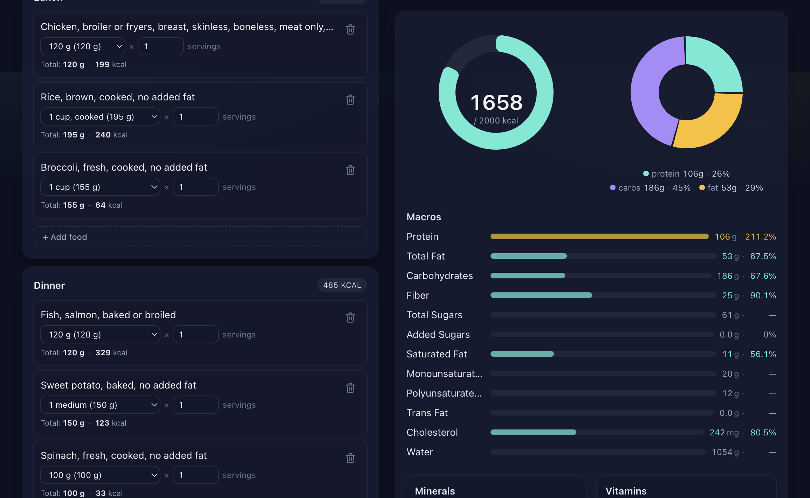

# Diet Rater

A local-first meal planner that lets you add foods to a daily meal plan and visualize the macro and micronutrient profile against FDA Daily Values. Food data is sourced from [USDA FoodData Central](https://fdc.nal.usda.gov/) (Foundation Foods + FNDDS Survey). Everything — the food database, your meal plans — lives in your browser via IndexedDB.

Built with Next.js (App Router) + TypeScript + Tailwind + Recharts. Deploys cleanly to Vercel.



## Features

- ~5,800 foods (363 Foundation, 5,431 FNDDS) shipped as a single static `public/data/foods.json` (~7.4 MB) and seeded into IndexedDB on first load.
- Autocomplete search across food names + categories (MiniSearch index, built in the browser from the IndexedDB foods so future user-created custom foods can join the same index).
- Per-day plan with breakfast / lunch / dinner / snacks slots.
- TODO-style inline editing on every entry: switch portion, type a custom gram amount, set a decimal serving multiplier (`0.5`, `1.25`, `2.75`, etc.), or delete the row.
- First-run sample meal (resolved at build time, served as static `demo-plan.json`) so the visualization is never empty. Dismiss it with **Clear day** or the in-banner **Dismiss** link.
- Macros: calorie ring, macro pie, and per-macro `% Daily Value` bars.
- Minerals + vitamins: grouped `% DV` bars colored by intake threshold (under 50 % / 50–100 % / over 100 %, with limit nutrients like sodium and saturated fat going red past 100 %).
- All data stays on-device. No accounts, no servers.

## Local development

```bash
cd diet-rater
npm install
npm run dev
```

Open <http://localhost:3000>. The first load fetches `/data/meta.json`, then `/data/foods.json` (~7.4 MB) once, bulk-inserts the foods into IndexedDB, and builds the MiniSearch index in memory. Subsequent loads are instant — IndexedDB has the data and the meta version check skips the network round trip entirely.

### Scripts

| Command              | What it does |
|----------------------|--------------|
| `npm run dev`        | Next.js dev server with hot reload |
| `npm run build`      | Production build (used by Vercel) |
| `npm run start`      | Serve the production build |
| `npm run lint`       | `next lint` |
| `npm run typecheck`  | `tsc --noEmit` |
| `npm run build:data` | Re-generate the `public/data/` artifacts from USDA |

## Refreshing the food database

USDA publishes new versions of Foundation Foods every six months and FNDDS every two years. To refresh:

1. Update the `FOUNDATION_DATE` / `SURVEY_DATE` constants at the top of [`scripts/extract-fdc-data.ts`](scripts/extract-fdc-data.ts) to the new release.
2. Run `npm run build:data` from `diet-rater/`. The script:
   - Downloads each ZIP into `scripts/.cache/` (skipped if already cached).
   - Extracts the inner JSON to disk and parses it with `JSON.parse` (the FNDDS payload is ~150 MB extracted; Node's default heap handles it comfortably).
   - Normalizes every food to the compact shape declared in [`lib/types.ts`](lib/types.ts), filtering nutrients down to the `NUTRIENT_DEFS` list in [`lib/nutrients.ts`](lib/nutrients.ts).
   - Writes `public/data/foods.json`, `public/data/meta.json`, and a freshly resolved `public/data/demo-plan.json`.
3. Commit the regenerated `public/data/` so Vercel doesn't need build-time network access on every deploy.

When `meta.json`'s `version` field changes, every browser will automatically wipe its IndexedDB `foods` store on next visit and re-seed from the new file. Meal plans (`mealPlans` store) are not touched.

## Deploying to Vercel

This is a vanilla Next.js project — no `vercel.json` required.

1. Push to a Git repository.
2. Import the project at <https://vercel.com/new>, picking `diet-rater/` as the root if your repo has other folders.
3. Build command stays as the default `next build`. Output directory stays default.
4. Deploy.

Vercel's CDN will serve the static `public/data/*` files. The first user request to a region will populate the edge cache; from then on the data is served from the nearest POP.

## Project layout

```
diet-rater/
  app/                # Next.js App Router (layout + page)
  components/         # FoodSearch, MealSection, NutrientPanel, DataLoader
  lib/
    types.ts          # Shared types (Food, MealEntry, DailyPlan, ...)
    nutrients.ts      # FDC nutrient defs, Daily Values, totalsFor() aggregator
    db.ts             # IndexedDB schema + CRUD (foods, mealPlans, meta)
    seed.ts           # First-run download + bulk insert + index build
    search.ts         # MiniSearch wrapper with build/search/add/remove API
    demo.ts           # Fetch + clone the static demo plan
  scripts/
    extract-fdc-data.ts  # Build-time downloader + normalizer (npm run build:data)
    fetch-fdc.ts         # Download + unzip helpers
  public/data/        # Generated artifacts (committed)
    meta.json
    foods.json
    demo-plan.json
  docs/
    screenshot.png
```

## Data sourcing and licensing

- Food composition data: [USDA FoodData Central](https://fdc.nal.usda.gov/). The data is in the public domain (CC0 1.0). Suggested citation:

  > U.S. Department of Agriculture, Agricultural Research Service, Beltsville Human Nutrition Research Center. FoodData Central. \[Internet\]. Available from <https://fdc.nal.usda.gov/>.

- Daily Values: FDA 2016 reference for adults and children ≥ 4 years.

This project is unaffiliated with USDA or FDA.

## Out of scope (v1)

- The Branded Foods dataset (~500k items) — would need server-side search.
- Multi-day meal planning views (the data model already supports it via per-date `DailyPlan`s; only the UI is single-day for now).
- User-defined Daily Value targets (the `DailyPlan.targets` data path exists; only the editor UI is missing).
- User-created custom foods (the IndexedDB `foods` store and `addToSearchIndex` API are ready; only the UI is missing).
- Recipe builder with sub-ingredients.
- Multi-user sync. Everything is local.
